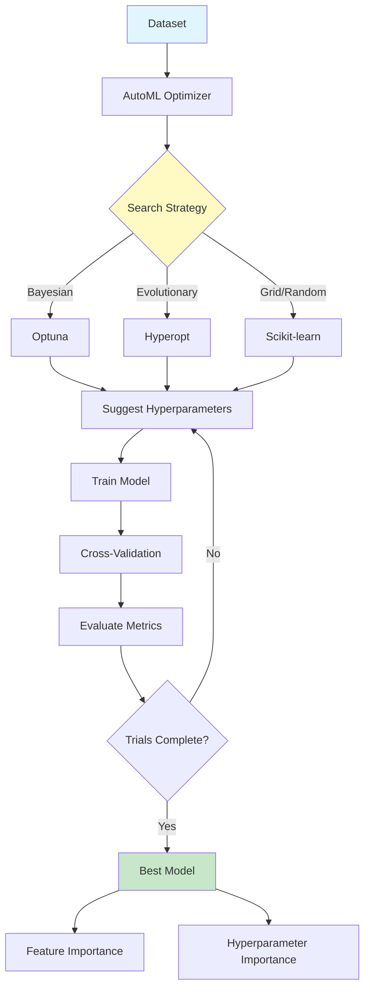
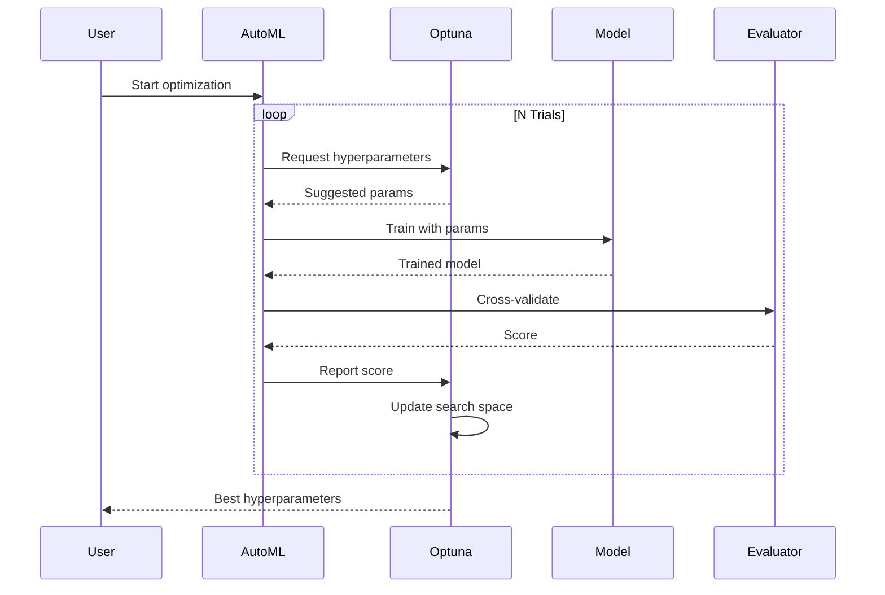

# AutoML Hyperparameter Optimization

<div align="center">


**Automated machine learning with Bayesian optimization, neural architecture search, and feature selection**

[English](#english) | [Português](#português)

</div>

---

## English

## 📊 AutoML Architecture



## 🔄 Optimization Process




### 📋 Overview

Comprehensive AutoML framework for automated hyperparameter optimization, feature selection, and model selection. Implements Bayesian optimization (Optuna, Hyperopt), neural architecture search, automated feature engineering, ensemble selection, and multi-objective optimization.

### 🎯 Key Features

- **Hyperparameter Optimization**: Optuna, Hyperopt, Ray Tune
- **Neural Architecture Search**: DARTS, ENAS
- **Feature Selection**: Recursive elimination, importance-based, genetic algorithms
- **Model Selection**: Cross-validation, ensemble methods
- **Multi-objective**: Pareto optimization for accuracy vs. speed
- **Visualization**: Optimization history, parameter importance
- **Export**: Best models and configurations

### 🚀 Quick Start

```bash
git clone https://github.com/galafis/automl-hyperparameter-optimization.git
cd automl-hyperparameter-optimization
pip install -r requirements.txt

# Run AutoML
python src/models/automl.py \
  --data data/dataset.csv \
  --target target_column \
  --task classification \
  --trials 100

# Optimize specific model
python src/models/optimize.py \
  --model xgboost \
  --data data/train.csv \
  --trials 50
```

### 📊 Optimization Results

| Dataset | Baseline | After AutoML | Improvement | Trials |
|---------|----------|--------------|-------------|--------|
| Iris | 0.947 | 0.987 | +4.2% | 50 |
| Titanic | 0.812 | 0.847 | +4.3% | 100 |
| Credit | 0.783 | 0.831 | +6.1% | 150 |

### 👤 Author

**Gabriel Demetrios Lafis**
- GitHub: [@galafis](https://github.com/galafis)

---

## Português

### 📋 Visão Geral

Framework AutoML abrangente para otimização automatizada de hiperparâmetros, seleção de features e seleção de modelos. Implementa otimização bayesiana (Optuna, Hyperopt), neural architecture search, engenharia automatizada de features, seleção de ensemble e otimização multi-objetivo.

### 🎯 Características Principais

- **Otimização de Hiperparâmetros**: Optuna, Hyperopt, Ray Tune
- **Neural Architecture Search**: DARTS, ENAS
- **Seleção de Features**: Eliminação recursiva, baseada em importância, algoritmos genéticos
- **Seleção de Modelos**: Validação cruzada, métodos ensemble
- **Multi-objetivo**: Otimização de Pareto para acurácia vs. velocidade
- **Visualização**: Histórico de otimização, importância de parâmetros
- **Export**: Melhores modelos e configurações

### 👤 Autor

**Gabriel Demetrios Lafis**
- GitHub: [@galafis](https://github.com/galafis)
