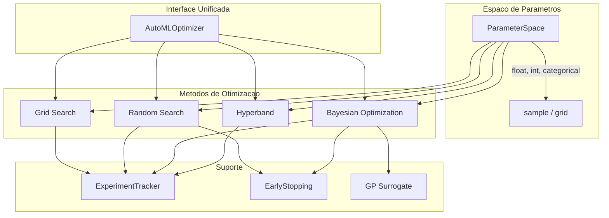
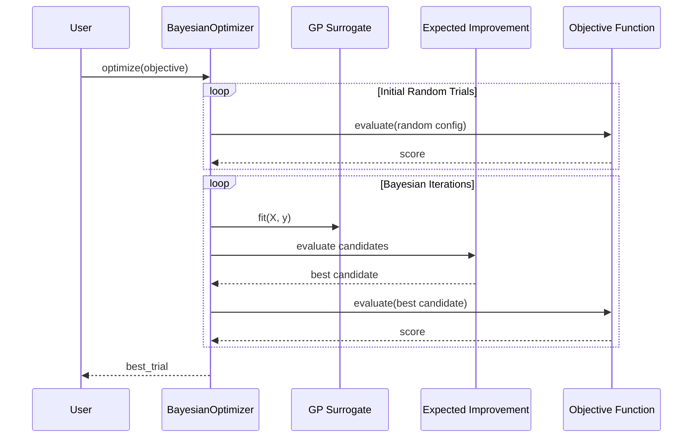

# AutoML Hyperparameter Optimization

[](https://www.python.org/)
[](LICENSE)

Sistema AutoML para otimizacao de hiperparametros. Inclui grid search, random search, otimizacao Bayesiana com Gaussian Process, Hyperband, early stopping, definicao de espacos de parametros e rastreamento de experimentos.

AutoML system for hyperparameter optimization. Includes grid search, random search, Bayesian optimization with Gaussian Process surrogate, Hyperband, early stopping, parameter space definition, and experiment tracking.

---

## Arquitetura / Architecture


```mermaid
graph TB
    subgraph Space["Espaco de Parametros"]
        PS[ParameterSpace]
        PS --> |float, int, categorical| SAMPLE[sample / grid]
    end

    subgraph Methods["Metodos de Otimizacao"]
        GS[Grid Search]
        RS[Random Search]
        BO[Bayesian Optimization]
        HB[Hyperband]
    end

    subgraph Support["Suporte"]
        ET[ExperimentTracker]
        ES[EarlyStopping]
        GP[GP Surrogate]
    end

    subgraph Interface["Interface Unificada"]
        AML[AutoMLOptimizer]
    end

    PS --> GS
    PS --> RS
    PS --> BO
    PS --> HB
    BO --> GP
    RS --> ES
    BO --> ES
    GS --> ET
    RS --> ET
    BO --> ET
    HB --> ET
    AML --> GS
    AML --> RS
    AML --> BO
    AML --> HB
```

## Fluxo Bayesiano / Bayesian Flow


```mermaid
sequenceDiagram
    participant User
    participant BO as BayesianOptimizer
    participant GP as GP Surrogate
    participant EI as Expected Improvement
    participant Obj as Objective Function

    User->>BO: optimize(objective)
    loop Initial Random Trials
        BO->>Obj: evaluate(random config)
        Obj-->>BO: score
    end
    loop Bayesian Iterations
        BO->>GP: fit(X, y)
        BO->>EI: evaluate candidates
        EI-->>BO: best candidate
        BO->>Obj: evaluate(best candidate)
        Obj-->>BO: score
    end
    BO-->>User: best_trial
```

## Funcionalidades / Features

| Funcionalidade / Feature | Descricao / Description |
|---|---|
| Parameter Space | Definicao de float, int e categorical / float, int, and categorical parameter definition |
| Grid Search | Busca exaustiva em grade / Exhaustive grid search |
| Random Search | Amostragem aleatoria com seed / Random sampling with seed |
| Bayesian Optimization | GP surrogate com Expected Improvement / GP surrogate with Expected Improvement |
| Hyperband | Alocacao adaptativa de budget / Adaptive budget allocation |
| Early Stopping | Parada quando nao ha melhoria / Stop when no improvement |
| Experiment Tracker | Log de trials, melhor score ao longo do tempo / Trial logging, best score over time |

## Inicio Rapido / Quick Start

```python
from src.models.optimizer import AutoMLOptimizer, ParameterSpace

space = (
    ParameterSpace()
    .add_float("learning_rate", 0.001, 0.1, log_scale=True)
    .add_int("max_depth", 3, 10)
    .add_categorical("algorithm", ["rf", "xgb", "lgbm"])
)

def objective(params):
    return -(params["learning_rate"] - 0.01) ** 2 - (params["max_depth"] - 6) ** 2

automl = AutoMLOptimizer(n_trials=50, method="bayesian")
best = automl.optimize(space, objective)
print(f"Best score: {automl.best_score}")
print(f"Best params: {automl.best_params}")
```

## Testes / Tests

```bash
pytest tests/ -v
```

## Tecnologias / Technologies

- Python 3.9+
- pytest

## Licenca / License

MIT License - veja [LICENSE](LICENSE) / see [LICENSE](LICENSE).
