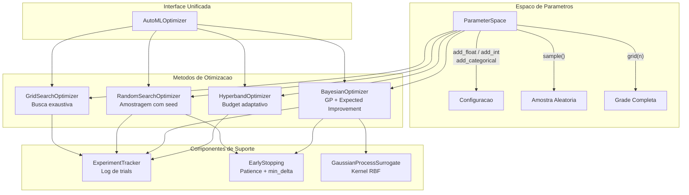
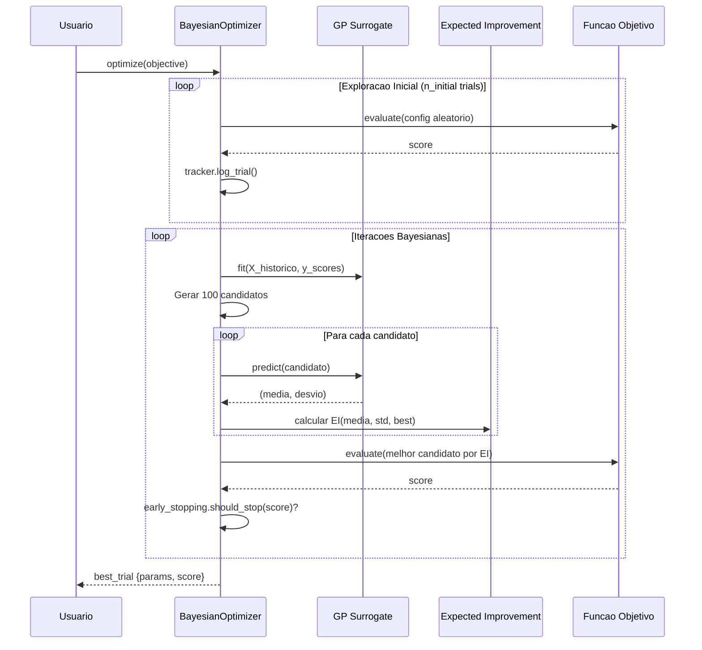
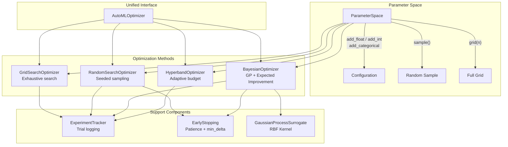
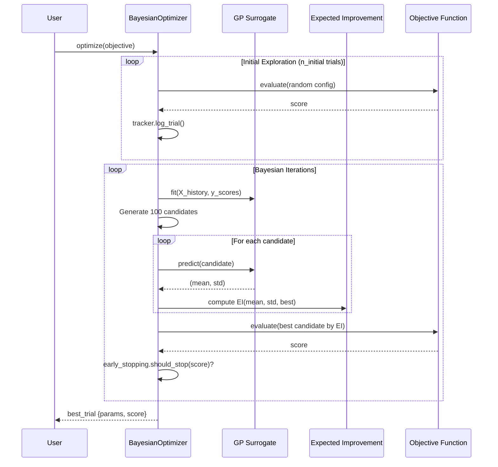

<div align="center">

# AutoML Hyperparameter Optimization

[](https://python.org)
[](LICENSE)
[](Dockerfile)
[](tests/)

Sistema AutoML para otimizacao de hiperparametros com quatro estrategias de busca: grid search, random search, otimizacao bayesiana com surrogate Gaussian Process e Hyperband, alem de early stopping e rastreamento de experimentos.

AutoML system for hyperparameter optimization with four search strategies: grid search, random search, Bayesian optimization with Gaussian Process surrogate and Hyperband, plus early stopping and experiment tracking.

[Portugues](#portugues) | [English](#english)

</div>

---

## Portugues

### Sobre

Framework AutoML puro em Python (sem dependencias externas para o motor de otimizacao) que implementa do zero quatro algoritmos de busca de hiperparametros. O modulo principal (`optimizer.py`) contem toda a logica: definicao flexivel de espacos de parametros (float, int, categorical com suporte a log-scale), grid search exaustivo, random search com seed reprodutivel, otimizacao bayesiana com surrogate GP (kernel RBF) e aquisicao Expected Improvement, alem de Hyperband com alocacao adaptativa de budget. Complementado por um rastreador de experimentos que registra cada trial e computa o melhor score ao longo do tempo, e um mecanismo de early stopping configuravel. Um segundo modulo (`automl.py`) demonstra integracao com Optuna, XGBoost e LightGBM para cenarios de producao.

### Tecnologias

| Tecnologia | Versao | Papel |
|---|---|---|
| **Python** | 3.9+ | Linguagem principal |
| **math / random** | stdlib | GP surrogate, amostragem, Hyperband |
| **Optuna** | >= 3.0.0 | Otimizacao bayesiana (modulo alternativo) |
| **scikit-learn** | >= 1.3.0 | Modelos ML e validacao cruzada |
| **XGBoost** | >= 2.0.0 | Gradient boosting |
| **LightGBM** | >= 4.0.0 | Gradient boosting |
| **pytest** | >= 7.3.0 | Suite de testes (24 testes) |
| **Docker** | - | Containerizacao |

### Arquitetura


```mermaid
graph TD
    subgraph Space["Espaco de Parametros"]
        PS["ParameterSpace"]
        PS --> |"add_float / add_int<br/>add_categorical"| CF["Configuracao"]
        PS --> |"sample()"| RND["Amostra Aleatoria"]
        PS --> |"grid(n)"| GRD["Grade Completa"]
    end

    subgraph Methods["Metodos de Otimizacao"]
        GS["GridSearchOptimizer<br/>Busca exaustiva"]
        RS["RandomSearchOptimizer<br/>Amostragem com seed"]
        BO["BayesianOptimizer<br/>GP + Expected Improvement"]
        HB["HyperbandOptimizer<br/>Budget adaptativo"]
    end

    subgraph Support["Componentes de Suporte"]
        ET["ExperimentTracker<br/>Log de trials"]
        ESt["EarlyStopping<br/>Patience + min_delta"]
        GP["GaussianProcessSurrogate<br/>Kernel RBF"]
    end

    subgraph Unified["Interface Unificada"]
        AML["AutoMLOptimizer"]
    end

    PS --> GS & RS & BO & HB
    BO --> GP
    RS --> ESt
    BO --> ESt
    GS & RS & BO & HB --> ET
    AML --> GS & RS & BO & HB
```

### Fluxo de Otimizacao Bayesiana


```mermaid
sequenceDiagram
    participant U as Usuario
    participant BO as BayesianOptimizer
    participant GP as GP Surrogate
    participant EI as Expected Improvement
    participant Obj as Funcao Objetivo

    U->>BO: optimize(objective)
    loop Exploracao Inicial (n_initial trials)
        BO->>Obj: evaluate(config aleatorio)
        Obj-->>BO: score
        BO->>BO: tracker.log_trial()
    end
    loop Iteracoes Bayesianas
        BO->>GP: fit(X_historico, y_scores)
        BO->>BO: Gerar 100 candidatos
        loop Para cada candidato
            BO->>GP: predict(candidato)
            GP-->>BO: (media, desvio)
            BO->>EI: calcular EI(media, std, best)
        end
        BO->>Obj: evaluate(melhor candidato por EI)
        Obj-->>BO: score
        BO->>BO: early_stopping.should_stop(score)?
    end
    BO-->>U: best_trial {params, score}
```

### Estrutura do Projeto

```
automl-hyperparameter-optimization/
├── src/
│   ├── __init__.py
│   ├── models/
│   │   ├── __init__.py
│   │   ├── optimizer.py                  # Motor principal: 8 classes (377 LOC)
│   │   └── automl.py                     # Integracao Optuna/XGBoost/LightGBM (290 LOC)
│   ├── data/
│   │   └── __init__.py
│   └── utils/
│       └── __init__.py
├── tests/
│   ├── __init__.py
│   └── test_models.py                   # 24 testes unitarios (201 LOC)
├── assets/
├── data/
├── notebooks/
├── .gitignore
├── Dockerfile
├── LICENSE                               # MIT
├── README.md
├── pytest.ini
├── requirements.txt
└── setup.py
```

### Inicio Rapido

```bash
# Clonar repositorio
git clone https://github.com/galafis/automl-hyperparameter-optimization.git
cd automl-hyperparameter-optimization

# Criar ambiente virtual
python -m venv venv
source venv/bin/activate  # Windows: venv\Scripts\activate

# Instalar dependencias
pip install -r requirements.txt

# Executar otimizacao
python -c "
from src.models.optimizer import AutoMLOptimizer, ParameterSpace

space = (
    ParameterSpace()
    .add_float('x', -5, 5)
    .add_float('y', -5, 5)
)

def objective(params):
    return -(params['x']**2 + params['y']**2)

automl = AutoMLOptimizer(n_trials=50, method='bayesian')
best = automl.optimize(space, objective)
print(f'Melhor score: {automl.best_score:.4f}')
print(f'Melhores params: {automl.best_params}')
"
```

### Docker

```bash
docker build -t automl-optimizer .
docker run --rm automl-optimizer
```

### Testes

```bash
# Executar todos os 24 testes
pytest tests/ -v

# Com cobertura
pytest tests/ --cov=src --cov-report=term-missing
```

### Benchmarks

| Metodo | 50 Trials (2D) | 100 Trials (2D) | Convergencia |
|---|---|---|---|
| Grid Search | ~1 ms | ~3 ms | Deterministica |
| Random Search | ~2 ms | ~4 ms | Estocastica |
| Bayesian (GP) | ~50 ms | ~200 ms | Guiada por surrogate |
| Hyperband | ~10 ms | ~30 ms | Adaptativa |

### Exemplo de Uso

```python
from src.models.optimizer import (
    AutoMLOptimizer, ParameterSpace, BayesianOptimizer
)

# Definir espaco de hiperparametros
space = (
    ParameterSpace()
    .add_float("learning_rate", 0.001, 0.1, log_scale=True)
    .add_int("max_depth", 3, 10)
    .add_categorical("algorithm", ["rf", "xgb", "lgbm"])
)

# Funcao objetivo (exemplo sintetico)
def objective(params):
    return -(params["learning_rate"] - 0.01)**2 - (params["max_depth"] - 6)**2

# Via interface unificada
automl = AutoMLOptimizer(n_trials=50, method="bayesian")
best = automl.optimize(space, objective)
print(f"Best score: {automl.best_score}")
print(f"Best params: {automl.best_params}")

# Rastreamento de experimentos
tracker = automl.tracker
print(f"Total trials: {tracker.n_trials}")
print(f"Score progression: {tracker.best_score_over_time()[:5]}")
```

### Aplicabilidade na Industria

| Setor | Caso de Uso | Metodo Recomendado |
|---|---|---|
| **Data Science** | Tuning de modelos ML em producao | Bayesian + Early Stopping |
| **Fintech** | Otimizacao de modelos de credito | Bayesian (GP) |
| **E-commerce** | Ranking e recomendacao | Hyperband (budget adaptativo) |
| **Saude** | Modelos preditivos clinicos | Grid Search (espaco pequeno) |
| **Adtech** | Otimizacao de bidding | Random Search + Early Stopping |
| **Pesquisa** | Benchmarking de algoritmos | Grid Search exaustivo |

### Licenca

Este projeto esta licenciado sob a Licenca MIT - veja o arquivo [LICENSE](LICENSE) para detalhes.

---

## English

### About

Pure Python AutoML framework (no external dependencies for the optimization engine) implementing from scratch four hyperparameter search algorithms. The main module (`optimizer.py`) contains all the logic: flexible parameter space definition (float, int, categorical with log-scale support), exhaustive grid search, reproducible random search with seed, Bayesian optimization with GP surrogate (RBF kernel) and Expected Improvement acquisition, plus Hyperband with adaptive budget allocation. Complemented by an experiment tracker that logs every trial and computes the best score over time, and a configurable early stopping mechanism. A second module (`automl.py`) demonstrates integration with Optuna, XGBoost and LightGBM for production scenarios.

### Technologies

| Technology | Version | Role |
|---|---|---|
| **Python** | 3.9+ | Core language |
| **math / random** | stdlib | GP surrogate, sampling, Hyperband |
| **Optuna** | >= 3.0.0 | Bayesian optimization (alternative module) |
| **scikit-learn** | >= 1.3.0 | ML models and cross-validation |
| **XGBoost** | >= 2.0.0 | Gradient boosting |
| **LightGBM** | >= 4.0.0 | Gradient boosting |
| **pytest** | >= 7.3.0 | Test suite (24 tests) |
| **Docker** | - | Containerization |

### Architecture


```mermaid
graph TD
    subgraph Space["Parameter Space"]
        PS["ParameterSpace"]
        PS --> |"add_float / add_int<br/>add_categorical"| CF["Configuration"]
        PS --> |"sample()"| RND["Random Sample"]
        PS --> |"grid(n)"| GRD["Full Grid"]
    end

    subgraph Methods["Optimization Methods"]
        GS["GridSearchOptimizer<br/>Exhaustive search"]
        RS["RandomSearchOptimizer<br/>Seeded sampling"]
        BO["BayesianOptimizer<br/>GP + Expected Improvement"]
        HB["HyperbandOptimizer<br/>Adaptive budget"]
    end

    subgraph Support["Support Components"]
        ET["ExperimentTracker<br/>Trial logging"]
        ESt["EarlyStopping<br/>Patience + min_delta"]
        GP["GaussianProcessSurrogate<br/>RBF Kernel"]
    end

    subgraph Unified["Unified Interface"]
        AML["AutoMLOptimizer"]
    end

    PS --> GS & RS & BO & HB
    BO --> GP
    RS --> ESt
    BO --> ESt
    GS & RS & BO & HB --> ET
    AML --> GS & RS & BO & HB
```

### Bayesian Optimization Flow


```mermaid
sequenceDiagram
    participant U as User
    participant BO as BayesianOptimizer
    participant GP as GP Surrogate
    participant EI as Expected Improvement
    participant Obj as Objective Function

    U->>BO: optimize(objective)
    loop Initial Exploration (n_initial trials)
        BO->>Obj: evaluate(random config)
        Obj-->>BO: score
        BO->>BO: tracker.log_trial()
    end
    loop Bayesian Iterations
        BO->>GP: fit(X_history, y_scores)
        BO->>BO: Generate 100 candidates
        loop For each candidate
            BO->>GP: predict(candidate)
            GP-->>BO: (mean, std)
            BO->>EI: compute EI(mean, std, best)
        end
        BO->>Obj: evaluate(best candidate by EI)
        Obj-->>BO: score
        BO->>BO: early_stopping.should_stop(score)?
    end
    BO-->>U: best_trial {params, score}
```

### Project Structure

```
automl-hyperparameter-optimization/
├── src/
│   ├── __init__.py
│   ├── models/
│   │   ├── __init__.py
│   │   ├── optimizer.py                  # Core engine: 8 classes (377 LOC)
│   │   └── automl.py                     # Optuna/XGBoost/LightGBM integration (290 LOC)
│   ├── data/
│   │   └── __init__.py
│   └── utils/
│       └── __init__.py
├── tests/
│   ├── __init__.py
│   └── test_models.py                   # 24 unit tests (201 LOC)
├── assets/
├── data/
├── notebooks/
├── .gitignore
├── Dockerfile
├── LICENSE                               # MIT
├── README.md
├── pytest.ini
├── requirements.txt
└── setup.py
```

### Quick Start

```bash
# Clone repository
git clone https://github.com/galafis/automl-hyperparameter-optimization.git
cd automl-hyperparameter-optimization

# Create virtual environment
python -m venv venv
source venv/bin/activate  # Windows: venv\Scripts\activate

# Install dependencies
pip install -r requirements.txt

# Run optimization
python -c "
from src.models.optimizer import AutoMLOptimizer, ParameterSpace

space = (
    ParameterSpace()
    .add_float('x', -5, 5)
    .add_float('y', -5, 5)
)

def objective(params):
    return -(params['x']**2 + params['y']**2)

automl = AutoMLOptimizer(n_trials=50, method='bayesian')
best = automl.optimize(space, objective)
print(f'Best score: {automl.best_score:.4f}')
print(f'Best params: {automl.best_params}')
"
```

### Docker

```bash
docker build -t automl-optimizer .
docker run --rm automl-optimizer
```

### Tests

```bash
# Run all 24 tests
pytest tests/ -v

# With coverage
pytest tests/ --cov=src --cov-report=term-missing
```

### Benchmarks

| Method | 50 Trials (2D) | 100 Trials (2D) | Convergence |
|---|---|---|---|
| Grid Search | ~1 ms | ~3 ms | Deterministic |
| Random Search | ~2 ms | ~4 ms | Stochastic |
| Bayesian (GP) | ~50 ms | ~200 ms | Surrogate-guided |
| Hyperband | ~10 ms | ~30 ms | Adaptive |

### Usage Example

```python
from src.models.optimizer import (
    AutoMLOptimizer, ParameterSpace, BayesianOptimizer
)

# Define hyperparameter space
space = (
    ParameterSpace()
    .add_float("learning_rate", 0.001, 0.1, log_scale=True)
    .add_int("max_depth", 3, 10)
    .add_categorical("algorithm", ["rf", "xgb", "lgbm"])
)

# Objective function (synthetic example)
def objective(params):
    return -(params["learning_rate"] - 0.01)**2 - (params["max_depth"] - 6)**2

# Via unified interface
automl = AutoMLOptimizer(n_trials=50, method="bayesian")
best = automl.optimize(space, objective)
print(f"Best score: {automl.best_score}")
print(f"Best params: {automl.best_params}")

# Experiment tracking
tracker = automl.tracker
print(f"Total trials: {tracker.n_trials}")
print(f"Score progression: {tracker.best_score_over_time()[:5]}")
```

### Industry Applicability

| Sector | Use Case | Recommended Method |
|---|---|---|
| **Data Science** | ML model tuning in production | Bayesian + Early Stopping |
| **Fintech** | Credit model optimization | Bayesian (GP) |
| **E-commerce** | Ranking and recommendation | Hyperband (adaptive budget) |
| **Healthcare** | Clinical predictive models | Grid Search (small space) |
| **Adtech** | Bidding optimization | Random Search + Early Stopping |
| **Research** | Algorithm benchmarking | Exhaustive Grid Search |

### License

This project is licensed under the MIT License - see the [LICENSE](LICENSE) file for details.

---

<div align="center">

**Autor / Author:** Gabriel Demetrios Lafis

[](https://github.com/galafis)
[](https://linkedin.com/in/gabriel-demetrios-lafis)

</div>
